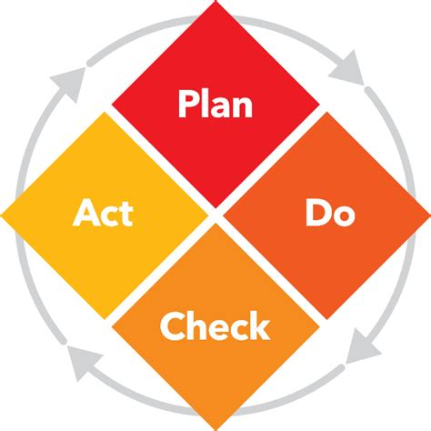

## Advanced workshop for the Worflow Orchestrator Framework

ESnet - SURF

---

## Agenda

- Intro -  Who's, who and why are you here?
- What are the workshop goals?
    - Introduction into Orchestrator concepts
    - Setting up the development environments
    - Advanced Orchestrator concepts
- Writing a simple workflow (node)
- Introducing Hierarchy in a more complex workflow (circuit)
- How can you implement the orchestrator concepts at your own institution (discussion)?

---
## Workshop goals
After this workshop you can:
- Understand the fundamentals of the orchestrator-core
- You understand basic product modeling
- You can create a simple workflow with basic validation
- You have a working docker setup which you can use to extend from at your home institution.

---
## What is orchestration?

"Orchestration is the automated arrangement, coordination, and management of computer systems, middleware, and services."

.svg%2F1250px-Wikipedia_logo_(svg).svg.png&f=1&nofb=1&ipt=842c6bc10d56c3131efdcb2920a01798911097d8486ac9af7fd09f0f4fe11c5e&ipo=images)

---
## What is the orchestrator?
`The orchestrator is a tool that can be used to execute arbitrary tasks on product subscriptions`

A user will typically subscribe to a product and the orchestrator will manage lifecycle, state transitions and provide a full audit log of all changes the subscription would go through.

---

Orchestration is more about data sanity and data management, than about provisioning services.

---